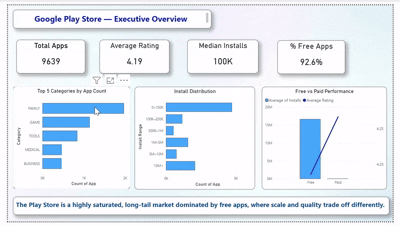

# 📊 Google Play Store Analysis – Power BI

## 📌 Project Overview
This project presents an interactive **Power BI dashboard** built to analyze the Google Play Store ecosystem.  
The dashboard explores app distribution, ratings, installs, and category-wise performance to understand what drives app popularity and user engagement.

📂 **Dashboard File:**   
[google_playstore_analysis.pbix](google_playstore_analysis.pbix)

📂 **Dataset Used:**  
[Google-playstore-dataset.csv](Google-playstore-dataset.csv)

---

## 🎯 Project Objectives
- Analyze the distribution of apps across different categories
- Understand rating patterns and install trends
- Compare free vs paid apps
- Identify high-performing app categories based on user engagement

---
## 📄 Page 1: Executive Overview

This page provides a high-level summary of the Google Play Store, highlighting key metrics and overall trends across all apps.

### 🔍 What this page shows:
- Total number of apps available on the Play Store
- Average app rating across all categories
- Median number of installs
- Percentage of free vs paid apps
- Overall install distribution to understand market scale

## 📄 Page 2: Category Insights

This page dives deeper into app performance across different categories to understand which domains dominate the Play Store.

### 🔍 What this page shows:
- App count by category
- Average rating per category
- Comparison of free and paid apps across categories
- Identification of high-performing and saturated categories

## 📄 Page 3: Ratings & Installs Analysis

This page focuses on understanding the relationship between user ratings and install counts.

### 🔍 What this page shows:
- Relationship between app ratings and install volumes
- Top categories based on total installs
- Insights into user preferences and engagement behavior

## 🛠️ Skills Showcased

This project was a hands-on journey through core **Power BI and data analytics concepts**.  
Here’s what was implemented and demonstrated:

⚙️ **Data Cleaning & Transformation (Power Query)**  
- Cleaned raw Google Play Store data  
- Handled missing values and inconsistent data types  
- Created new calculated columns for analysis  

🧮 **Measures & KPIs (DAX)**  
- Created measures for average rating, median installs, and app counts  
- Built meaningful KPIs to summarize key insights  

📊 **Data Visualization**  
- Used Column Charts, Bar Charts, and Line Charts for trend analysis  
- Designed visuals to clearly compare categories and performance metrics  

📌 **KPI Cards & Tables**  
- Used Card visuals to highlight key metrics  
- Used Tables for detailed, category-level insights  

🖱️ **Interactive Reporting**  
- Slicers to filter data dynamically by category and app type  
- Cross-filtering between visuals for better exploration  

🎨 **Dashboard Design & Layout**  
- Designed a clean, intuitive, and easy-to-navigate dashboard  
- Focused on clarity, consistency, and storytelling through visuals  

## 🚀 Key Insights
- Most apps on the Play Store are free, but paid apps often show slightly higher average ratings  
- Categories like Games and Communication dominate total installs  
- High installs do not always guarantee higher ratings, indicating varied user expectations  

---

## 👩‍💻 Created By
**Madhu Shree**

